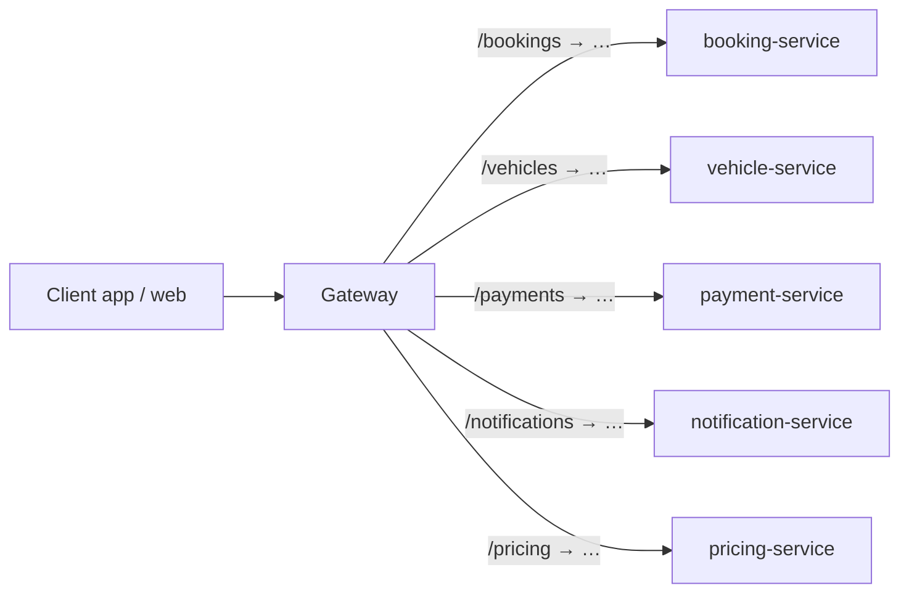
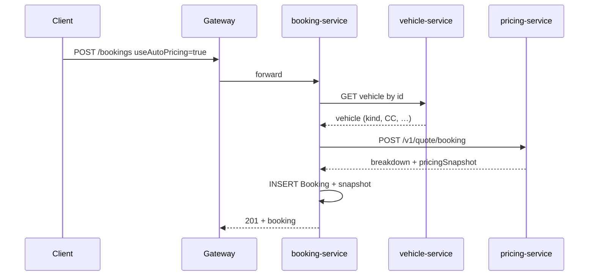
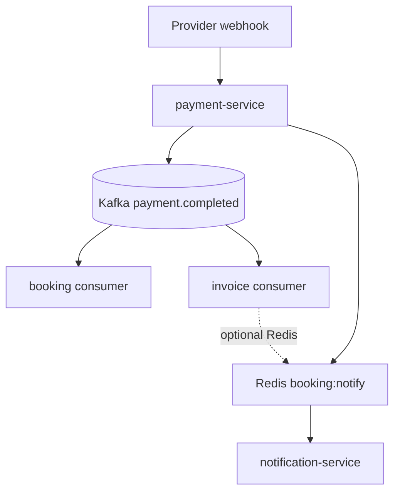

# Flows — how the application works

This document explains **end-to-end flows** in plain terms: what happens when a user (or system) takes an action, and which services talk to each other. It complements [ARCHITECTURE.md](ARCHITECTURE.md) (components & scaling) and the root [Readme.md](../Readme.md) (how to run).

---

## 1. Every request through the API gateway

Most clients call a **single base URL** (e.g. `https://api.example.com` or `http://localhost:5000`). The **gateway** routes paths to the right service; path prefixes are **stripped** when forwarding, so each service can keep simple routes internally.

**Typical rule:** the browser or mobile app **never** calls `booking-service:5004` directly in production; it only calls the **gateway**, which is where you add TLS, WAF, and global rate limits.

---

## 2. Vehicle catalog and attributes

1. **Admin / ops** manage vehicles in **vehicle-service** (branches, registration, `vehicleKind`, `engineCC`, `loadCapacityKg` for auto-pricing, base price, status).
2. **Apps** list and show vehicle detail via **gateway** → **vehicle-service**.
3. For **auto-pricing**, each vehicle should have the fields the **pricing** engine needs (e.g. `BIKE` + `engineCC`); see [Section 4](#4-pricing--quote--booking-snapshot).

---

## 3. Creating a booking

### 3.1 Manual amounts (legacy / custom)

1. Client **POST** ` /bookings` (through gateway) with `userId`, `vehicleId`, `startAt`, `endAt`, and **money fields** you already send today (`baseAmount`, `totalAmount`, fees, etc.).
2. **booking-service** checks **no overlapping** booking for that vehicle, writes a **Booking** row, records a **BOOKING_CREATED** event, and **publishes** a small JSON message to **Redis** channel `booking:notify` (name configurable).
3. **notification-service** (if running) is **subscribed** to that channel, **persists** an in-app notification, and may push it over **WebSockets** to connected users.

### 3.2 Auto-pricing (optional)

If the client sends **`useAutoPricing: true`** (and the service is configured with **vehicle** and **pricing** URLs):

1. **booking-service** **GET**s the **vehicle** from **vehicle-service** (engine CC, kind, load capacity, etc.).
2. It **POST**s a **quote** to **pricing-service** (`/v1/quote/booking`) with the rental window and **estimated** km.
3. **pricing-service** loads the **active rule version** (from DB, optionally **cached in Redis**), classifies the vehicle into a **tier**, computes the **rental subtotal** (per-day + weekend rules + extra km), and returns a **pricing snapshot** (version label, rates, breakdown).
4. **booking-service** stores **`pricingSnapshot`** and **`pricingVersionLabel`** on the booking and fills **base / extra / included km / per-km / hourly** fields from the quote. That snapshot is the **contract for billing** for that booking — **do not silently recalculate** later using live rules.

---

## 4. Pricing & quote & booking snapshot

- **Rules** live in **pricing-service** (versioned tiers in PostgreSQL; **admin APIs** under `/admin/v1/...` with API key).
- A **quote** is computed from **start/end dates**, **estimated km**, and **vehicle attributes**.
- After booking creation with auto-pricing, **billing at return time** should use the **stored snapshot** (+ actual km and late return), not a fresh tier lookup — so prices stay fair and predictable.

---

## 5. Trip lifecycle (pickup → active → return)

1. **Start trip:** client calls **POST** `/bookings/:id/start` → booking becomes **ACTIVE**, overdue scheduling may start (Temporal/workers depending on deployment).
2. **Complete trip:** **POST** `/bookings/:id/complete` → status **COMPLETED**, bill-related fields updated from distance/overdue logic in **booking-service**.
3. **Checkout / pay:** client calls **POST** `/bookings/:id/checkout` → **booking-service** calls **payment-service** to create a **payment** intent for the computed amount; user pays via provider UI or mock flow.

Each important step can emit **Redis** notifications (`BOOKING_STARTED`, `BOOKING_COMPLETED`, `CHECKOUT_CREATED`, etc.) so **notification-service** can fan out to users.

---

## 6. Payment success → Kafka → booking & invoice & notifications

This is the **async backbone** for scaling: the HTTP path only needs to record payment success reliably; **downstream** work happens in consumers.

1. **Payment provider** sends a **webhook** to **payment-service** → payment row moves to **SUCCESS**, ledger / idempotency rules apply.
2. A **relay worker** in **payment-service** builds a **versioned envelope** (often after fetching the **bill** from **booking-service**), then **produces** a message to Kafka topic **`payment.completed`**.
3. **booking-service** Kafka **consumer** reads the envelope and updates **booking payment status** to **PAID** (and may emit a **PAYMENT_STATUS_UPDATED** notification via Redis).
4. **invoice-service** Kafka **consumer** creates or updates the **invoice** from the same envelope; it may also publish an **invoice** notification to Redis.
5. **payment-service** may also publish a **“final bill ready”**-style event to Redis after Kafka produce (depending on configuration).

If **Kafka** or a consumer is temporarily down, relay/configured **retry** paths prevent silent loss of money-side effects (exact behaviour depends on env and DLQ settings).

---

## 7. Notifications (in-app + real-time)

1. Any service that needs to notify the user **publishes JSON** to Redis **`booking:notify`** (or **`alerts:notify`** for vehicle/telemetry alerts).
2. **notification-service** runs a **subscriber** that **writes** rows to its DB and marks them sent.
3. **Socket.IO** broadcasts `notification` events; clients should **`join-user`** with `userId` to receive user-targeted events.

**Important:** Redis pub/sub is **fire-and-forget** — if **notification-service** is stopped, those messages are **not** queued; production setups rely on **healthy subscribers** and monitoring.

---

## 8. Pricing administration (ops)

1. Set **`PRICING_ADMIN_API_KEY`** on **pricing-service**.
2. Call **POST/PATCH/DELETE** on **`/admin/v1/...`** (via gateway: **`/pricing/admin/v1/...`**) to manage **rule versions** and **tiers**.
3. **Activate** one rule version for production quotes; **cache bust** runs after changes so quotes pick up new rules quickly.

---

## 9. Quick mental model

| Concern | Where it lives |
|--------|----------------|
| Who can book what vehicle | **booking-service** + **vehicle-service** |
| How much the rental costs | **pricing-service** (rules) → **snapshot on booking** |
| Money actually charged | **payment-service** + provider webhooks |
| Bookings know payment succeeded | **Kafka** → **booking-service** consumer |
| Official invoice PDF / record | **invoice-service** consumer |
| User sees toasts / notification center | **Redis** → **notification-service** + **WebSockets** |

---

## Related docs

- [ARCHITECTURE.md](ARCHITECTURE.md) — services list, scaling, tech stack.  
- [Readme.md](../Readme.md) — install, Docker, migrations, ports, E2E scripts.
